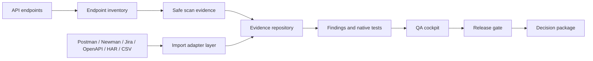

<p align="center">
  
</p>

<h1 align="center">Aptoria</h1>

<p align="center">
  <strong>Evidence-first API QA and release decision workspace.</strong><br>
  Turn scattered API review artifacts into structured evidence, findings, release gates and decision packages.
</p>

<p align="center">
  
  
  
  
  
</p>

> [!IMPORTANT]
> Aptoria is **source-available**, not open-source. Public repository access is provided for review, evaluation, portfolio presentation and controlled local testing. See [`LICENSE`](LICENSE), [`NOTICE.md`](NOTICE.md) and [`THIRD_PARTY_NOTICES.md`](THIRD_PARTY_NOTICES.md).

---

## What Aptoria does

Aptoria is a self-hosted QA review workspace for API-heavy projects. It helps a QA engineer, reviewer or release owner answer one practical question:

> What evidence do we have, what is missing, and can this release be approved responsibly?

It does not try to replace Postman, Newman, Jira, OpenAPI documents, HAR captures or existing test tools. Aptoria sits above them as an evidence and decision layer.

---

## Core workflow



---

## Main capabilities

| Area | What it gives you |
| --- | --- |
| Endpoint Inventory | Release-scope endpoints, environments, auth profiles and scan targets. |
| Safe Scan Evidence | Non-destructive request checks and response evidence. |
| Import Adapter Layer | Normalized input from Postman, Newman, Jira, OpenAPI, HAR and CSV artifacts. |
| Evidence Repository | Checksum-backed evidence records, lifecycle states and exportable proof. |
| Findings | Severity, status, duplicate handling, merge workflow and risk acceptance context. |
| Native Test Evidence | Test suites, test cases, runs and linked evidence. |
| QA Cockpit | Coverage, blind spots, confidence indicators and release readiness signals. |
| Release Gate | Reviewable go/no-go state with blockers, warnings and decision context. |
| Reports | HTML/PDF/JSON/Markdown/ZIP decision packages and evidence packs. |
| Audit Log | Traceable activity history for review and handoff. |

---

## Integrations and artifact sources

Aptoria can work with artifacts from tools and formats teams already use:

- Postman collections
- Newman CI result output
- Jira issue exports
- OpenAPI specifications
- HAR/network captures
- CSV-based QA records

The goal is to keep review evidence in one structured workspace instead of spreading it across screenshots, exported files, chat messages and release notes.

---

## Local evaluation

Requirements:

- PHP 8.2+
- Composer 2+
- SQLite enabled
- Node is not required for basic evaluation of the packaged UI assets

Basic setup:

```bash
cp .env.example .env
composer install
php artisan key:generate
touch database/database.sqlite
php artisan migrate --force
php artisan serve
```

Then open:

```text
http://127.0.0.1:8000
```

For Windows/XAMPP usage, see [`docs/INSTALL_WINDOWS_XAMPP.md`](docs/INSTALL_WINDOWS_XAMPP.md).

---

## License activation

Aptoria includes a license activation flow for distributed/customer builds. Generated license files, key material and runtime activation artifacts must never be committed to a public repository.

This repository intentionally does not document private activation operations, key handling, package generation or internal deployment procedures.

---

## Public repository safety

Do not commit:

- `.env`
- `vendor/` or `node_modules/`
- SQLite runtime databases
- generated reports or evidence exports containing customer data
- license files, public/private key files or activation artifacts
- real API tokens, bearer tokens, passwords or production request samples

See [`SECURITY.md`](SECURITY.md) for reporting and hygiene guidance.

---

## Project owner

GitHub: <https://github.com/Szujo-Janos>

---

## Status

Aptoria `0.0.x` is an active evidence-first rebuild line. It should be treated as an MVP/foundation release for review and controlled local testing, not as a hardened enterprise product.
