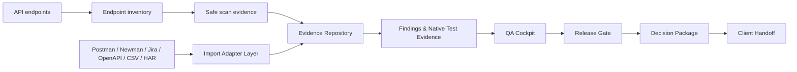
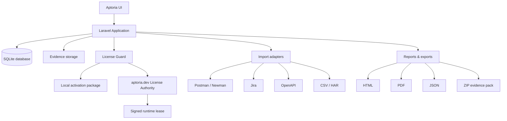

<p align="center">
  
</p>

<h1 align="center">Aptoria</h1>

<p align="center">
  <strong>Evidence-first API QA, coverage and release-decision platform.</strong><br>
  Turn scattered API QA artifacts into auditable evidence, release gates and decision packages.
</p>

<p align="center">
  
  
  
  
  
  
  
  
  
</p>

<table align="center">
  <tr>
    <td align="center"><strong>Current release</strong><br><code>v0.0.63</code></td>
    <td align="center"><strong>Repository line</strong><br><code>0.0.x evidence-first rebuild</code></td>
    <td align="center"><strong>Runtime direction</strong><br><code>portable + online license authority</code></td>
  </tr>
</table>

> [!NOTE]
> Aptoria is prepared for public GitHub presentation as a source-available project for review, evaluation, portfolio presentation and controlled local testing.

> [!IMPORTANT]
> Public visibility does not make Aptoria open-source. See `LICENSE`, `NOTICE.md`, `CREDITS.md` and `THIRD_PARTY_NOTICES.md`.

---

## Why Aptoria exists

**Aptoria** is a self-hosted, evidence-first API QA and release decision platform built with Laravel.

It is not a Postman, Newman, Jira, Datadog or full test-management clone. Its role is to collect and normalize the release-critical evidence those tools often leave scattered: endpoint inventory, safe scan proof, imported QA artifacts, native test evidence, findings, verified evidence, release gates and checksum-backed decision packages.

Aptoria exists to answer one release question:

> What evidence do we have, what is missing, and can this API release be approved responsibly?

---

## Product workflow



---

## Architecture overview



---

## At a glance

| Area | Purpose | Output |
|---|---|---|
| Endpoint Inventory | Track release-scope API endpoints | Endpoint scope and scan targets |
| Safe Scan Evidence | Capture non-destructive API QA proof | Evidence records and snapshots |
| Import Adapter Layer | Normalize external QA artifacts | Findings, assertions, tests and evidence |
| Evidence Repository | Store checksum-backed proof | Verified, archived and exportable evidence |
| Native Test Evidence | Record suites, cases and test runs | Linked test evidence and failed-run findings |
| QA Cockpit | Review coverage and blind spots | Confidence score and release readiness signals |
| Release Gate | Freeze approval state | Auditable go / no-go decision |
| Decision Package | Export the final review package | HTML, PDF, JSON, Markdown and ZIP |
| License Guard | Validate local activation and optional online runtime lease | Local package status, runtime lease cache and online authority state |

---

## Built for

| Role | What Aptoria gives them |
|---|---|
| QA Engineers | A structured place to collect endpoint, scan and test evidence |
| Reviewers | Verified evidence, findings and blind spots before release sign-off |
| Release Approvers | A clear release gate with an auditable decision trail |
| Clients | A clean decision handoff package instead of scattered QA files |
| Small teams | A self-hosted release evidence layer without adopting a full enterprise QA suite |
| Portable deployments | A guarded local runtime with activation package support and optional aptoria.dev authority checks |

---

## What Aptoria helps you answer

- Which API endpoints are in release scope?
- Which endpoints have safe scan evidence?
- Which external QA artifacts became normalized Aptoria findings, assertions, tests or evidence?
- Which native test cases and test runs support the release decision?
- Which evidence items are verified and checksum-backed?
- Which high/critical findings still block release?
- Which blind spots remain before sign-off?
- Can the release gate be frozen into an auditable decision package?
- Can the result be exported as HTML/PDF/JSON/Markdown/ZIP and later delivered through a client portal?
- Is this portable runtime locally activated and, when configured, online-verified by the license authority?

The goal is not to replace Postman, Newman, Jira, Playwright, OWASP tools or a full test-management platform. Aptoria is a self-hosted evidence and workflow layer for API QA and release review.

Release history is tracked in [`CHANGELOG.md`](CHANGELOG.md).

---

<details open>
<summary><strong>Current v0.0.63 feature line</strong></summary>

### Project and access foundation

- First-run setup wizard
- Standalone security hardening
- Local user onboarding with temporary passwords
- Project access and membership foundation
- Project roles: Project admin, QA engineer, Reviewer, Release approver and Read-only viewer
- Project-scoped route/access checks
- English default UI with Hungarian selectable UI direction

### Endpoint and safe QA evidence

- Project management
- Environment and auth profile foundations
- Endpoint inventory foundation
- Safe scan evidence foundation
- Assertion and endpoint snapshot foundations
- Finding workflow with deduplication / merge support

### Evidence Repository

- Project-level evidence repository
- SHA-256 evidence checksums
- Evidence lifecycle events
- Active / verified / archived repository states
- Archive instead of hard-delete behavior
- Evidence Pack HTML/PDF/JSON/Markdown/ZIP export paths

### Import Adapter Layer

- Normalized adapter direction for Postman/Newman/Jira/OpenAPI JSON/QA CSV/HAR-style inputs
- External artifacts are converted into Aptoria endpoints, assertions, findings, tests and repository evidence instead of being treated as raw imports
- OpenAPI JSON contract normalization foundation
- QA CSV test-result normalization foundation
- HAR/browser network import direction

### Native Test Evidence

- Native test suites
- Native test cases
- Native test runs
- Pass / fail / blocked / skipped states
- Every recorded run can create checksum-backed repository evidence
- Failed runs can create linked findings

### QA Cockpit and release decisions

- QA Cockpit with confidence score
- Coverage signals
- Blind spot detection
- Endpoint coverage matrix
- Release Gate Workflow foundation
- Release Gate Report & Decision Package exports
- Report Visual Standard for professional evidence documents

### Live demo and portable runtime direction

- Live/Sandbox workspace separation
- Public demo API and guided sandbox flow
- Portable USB runtime foundation
- One-package license activation flow
- Simplified License Management
- Optional online license authority client foundation for aptoria.dev runtime lease verification
- Runtime lease cache with offline grace support
- Basic runtime integrity manifest hash prepared for authority-side evaluation

</details>

---

## License direction

Aptoria supports a local signed activation package and prepares an optional online authority model.

The simple customer workflow is:

```text
license request → one activation package → upload package → use Aptoria
```

The recommended activation package contains:

```text
aptoria-license.json
license-public.pem
```

For guarded portable/customer builds, Aptoria can also be configured to ask `aptoria.dev` for a short-lived signed runtime lease. The local runtime can cache this lease for a limited offline grace period. This direction is intended to make casual code edits and copied runtimes harder to use without a server-side license decision.

The online authority server is expected to own:

- license status;
- allowed devices and fingerprints;
- activation limits;
- revocation status;
- runtime lease signing;
- heartbeat / last-seen tracking;
- optional release manifest validation.

The local portable runtime never receives the private signing key.

---

## Legacy replacement notice

This repository package replaces the old `aptoria-1.1.34` code line. The old branch is treated as archived historical code. The 0.0.x line is a rebuild with a cleaner evidence-first product direction, new UI rules and different database migrations.

This is a **fresh replacement**, not an in-place database upgrade.

Read before replacing an existing repository:

- `TRANSITION_SUMMARY.md`
- `docs/GITHUB_REPLACEMENT_CHECKLIST.md`
- `docs/ARCHITECTURE_TRANSITION_MAP.md`
- `docs/MVP_ROADMAP.md`
- `docs/PRODUCT_POSITIONING.md`

---

## Requirements

Recommended local development/runtime stack:

- PHP 8.2 or newer
- Composer
- SQLite extension enabled
- OpenSSL, PDO, Mbstring, Tokenizer, XML, Ctype, JSON and Fileinfo extensions
- XAMPP on Windows, or a standard PHP/Linux host

SQLite is the default local/self-hosted database target. Other SQL databases may be possible through Laravel's database layer, but the public v0.0.x workflow is documented around SQLite.

---

## Release ZIP / GitHub repository hygiene

The repository intentionally excludes machine-specific runtime state.

> [!WARNING]
> Never commit runtime files, local databases, setup locks, private keys, generated customer licenses, runtime leases or public storage output.

Do **not** commit or ship:

```text
vendor/
node_modules/
.env
database/database.sqlite
storage/app/installed.lock
storage/app/setup-token.txt
storage/app/aptoria-license.json
storage/app/license-public.pem
storage/app/license-authority-public.pem
storage/app/license-runtime-lease.json
storage/app/license-install-id
public/storage/
bootstrap/cache/
storage runtime files
```

Required public/release files include:

```text
.env.example
.env.testing
composer.json
artisan
scripts/update-windows-xampp.ps1
scripts/update-linux.sh
public/assets/aptoria-ui/vendor
README.md
LICENSE
NOTICE.md
CREDITS.md
THIRD_PARTY_NOTICES.md
SECURITY.md
```

The `bootstrap/cache` directory is created locally by the install/update scripts. It is intentionally not tracked because the public hygiene workflow treats it as runtime state.

---

## Quick start

| Step | Action |
|---|---|
| 1 | Clone or extract the repository |
| 2 | Run the Windows/XAMPP update script |
| 3 | Clear Laravel caches |
| 4 | Run migrations |
| 5 | Open `/setup` |
| 6 | Create the first admin user |
| 7 | Run the first QA workflow smoke test |

---

## Windows/XAMPP installation or replacement from ZIP

Prefer a clean target folder when replacing an older local copy so stale migrations, cached files and views cannot remain in `C:\xampp\htdocs\aptoria`.

Use this exact PowerShell template:

```powershell
$ZipPath = "E:\Aptoria\aptoria-0.0.63.zip"
$TempPath = "E:\Aptoria\_temp_aptoria_0.0.63"
$ProjectRoot = "C:\xampp\htdocs\aptoria"

Remove-Item $TempPath -Recurse -Force -ErrorAction SilentlyContinue
Expand-Archive -Path $ZipPath -DestinationPath $TempPath -Force
Copy-Item "$TempPath\aptoria-0.0.63\*" $ProjectRoot -Recurse -Force

cd $ProjectRoot
Set-ExecutionPolicy -Scope Process -ExecutionPolicy Bypass

.\scripts\update-windows-xampp.ps1

C:\xampp\php\php.exe artisan optimize:clear
C:\xampp\php\php.exe artisan view:clear
C:\xampp\php\php.exe artisan config:clear
C:\xampp\php\php.exe artisan route:clear
C:\xampp\php\php.exe artisan migrate

C:\xampp\php\php.exe artisan aptoria:health
C:\xampp\php\php.exe artisan test

C:\xampp\php\php.exe artisan serve
```

Then open:

```text
http://127.0.0.1:8000/setup
```

Complete setup in the browser.

---

## Public GitHub clone workflow

For a GitHub checkout, clone first instead of expanding a ZIP:

```powershell
$ProjectRoot = "C:\xampp\htdocs\aptoria"

Remove-Item $ProjectRoot -Recurse -Force -ErrorAction SilentlyContinue
git clone https://github.com/Szujo-Janos/Aptoria.git $ProjectRoot

cd $ProjectRoot
Set-ExecutionPolicy -Scope Process -ExecutionPolicy Bypass

.\scripts\update-windows-xampp.ps1

C:\xampp\php\php.exe artisan optimize:clear
C:\xampp\php\php.exe artisan view:clear
C:\xampp\php\php.exe artisan config:clear
C:\xampp\php\php.exe artisan route:clear
C:\xampp\php\php.exe artisan migrate
C:\xampp\php\php.exe artisan aptoria:health
C:\xampp\php\php.exe artisan test
C:\xampp\php\php.exe artisan serve
```

---

## First-run setup

On a clean installation, Aptoria redirects normal application pages to `/setup` until installation is completed.

The setup wizard can help with:

- environment diagnostics;
- `.env` creation;
- SQLite database file creation;
- `APP_KEY` generation;
- database migrations;
- first admin user creation;
- optional demo QA project import;
- setup lock creation.

The setup lock file is generated locally at:

```text
storage/app/installed.lock
```

This file must never be committed or included in a release ZIP.

After setup and migrations, run:

```powershell
C:\xampp\php\php.exe artisan aptoria:health
```

The same command supports JSON output:

```powershell
C:\xampp\php\php.exe artisan aptoria:health --json
```

---

## First QA workflow smoke test

After setup:

1. Create or open a project.
2. Create an environment and auth profile when needed.
3. Add or import endpoints.
4. Capture safe scan or test evidence.
5. Create findings and attach evidence.
6. Verify important evidence in the Evidence Repository.
7. Open QA Cockpit and review coverage/blind spots.
8. Create a Release Gate.
9. Review gate items.
10. Generate a Release Gate Decision Package.
11. Export HTML/PDF/JSON/ZIP evidence.

---

## Running tests

```powershell
cd "C:\xampp\htdocs\aptoria"
C:\xampp\php\php.exe artisan test
```

Useful focused checks for the v0.0.x rebuild:

```powershell
C:\xampp\php\php.exe artisan test --filter=StandaloneSecurityHardeningTest
C:\xampp\php\php.exe artisan test --filter=ProjectMembershipAccessTest
C:\xampp\php\php.exe artisan test --filter=EvidenceRepositoryFoundationTest
C:\xampp\php\php.exe artisan test --filter=NativeTestEvidenceModelTest
C:\xampp\php\php.exe artisan test --filter=QaCockpitCoverageFoundationTest
C:\xampp\php\php.exe artisan test --filter=ReleaseGateWorkflowFoundationTest
```

The test suite uses the `testing` environment and SQLite configuration.

---

## Public GitHub Actions QA gate

The public repository includes GitHub Actions metadata under:

```text
.github/workflows/public-hygiene.yml
```

The workflow checks public release hygiene, required public files, Composer metadata and PHP syntax. It intentionally fails when runtime/local paths such as `.env`, `vendor/`, `database/database.sqlite`, `storage/app/installed.lock`, `storage/app/setup-token.txt`, generated license files, runtime lease cache, `public/storage` or `bootstrap/cache` are committed.

---

## Documentation map

| Document | Purpose |
|---|---|
| `TRANSITION_SUMMARY.md` | Short explanation of the 1.1.34 → 0.0.x replacement |
| `docs/GITHUB_REPLACEMENT_CHECKLIST.md` | Public replacement checklist |
| `docs/ARCHITECTURE_TRANSITION_MAP.md` | Architecture transition map |
| `docs/INSTALL_WINDOWS_XAMPP.md` | Windows/XAMPP install/update workflow |
| `docs/QA_CHECKLIST.md` | Current release QA checklist |
| `docs/PROJECT_ACCESS_FOUNDATION.md` | Project access foundation |
| `docs/EVIDENCE_REPOSITORY_FOUNDATION.md` | Evidence Repository foundation |
| `docs/IMPORT_ADAPTER_LAYER.md` | Import Adapter Layer |
| `docs/NATIVE_TEST_EVIDENCE_MODEL.md` | Native Test Evidence model |
| `docs/QA_COCKPIT_COVERAGE_BLIND_SPOT_FOUNDATION.md` | QA Cockpit, coverage and blind spot foundation |
| `docs/RELEASE_GATE_WORKFLOW_FOUNDATION.md` | Release Gate Workflow foundation |
| `docs/RELEASE_GATE_REPORT_DECISION_PACKAGE.md` | Release Gate Report & Decision Package |
| `docs/REPORT_VISUAL_STANDARD.md` | Report Visual Standard |
| `docs/LICENSE_ACTIVATION_RECOVERY_FLOW.md` | License activation and simplified package workflow |
| `docs/ONLINE_LICENSE_AUTHORITY_CLIENT.md` | aptoria.dev online authority client foundation |
| `SERVER_INSTALLER.md` | First-run installer and operational notes |

---

## Security notes

- Keep `APP_DEBUG=false` in production.
- Use HTTPS in production.
- Replace default or temporary admin credentials immediately.
- Do not expose `.env`, SQLite database files or storage internals publicly.
- Keep setup locked after installation.
- Use a setup token only for controlled recovery/install flows.
- Back up `.env` together with database exports because encrypted auth/profile values may depend on the same application key.
- Keep private license signing keys on the authority/issuer side only.
- Do not commit customer licenses, authority public key files, runtime lease caches or install identifiers.

---

## Credits and copyright

Aptoria is designed and maintained by **János Szujó**.

Copyright © 2026 János Szujó. All rights reserved.

This repository is source-available for review, evaluation, portfolio presentation and controlled local testing. It is not an open-source project unless a separate written agreement says otherwise.

For ownership, credits and third-party dependency details, see:

- `LICENSE`
- `NOTICE.md`
- `CREDITS.md`
- `THIRD_PARTY_NOTICES.md`
